# BlueVideoRenamer
A simple application that uses the TVDB api (Version 2) to rename TV Shows (That you've backed up from purchases right!?)

Written in C# and currently targets .Net 4.5.2

Requirements: A [TVDB API Key](https://thetvdb.com/api-information)

Allows users to rename TV Show files based on results from The TV DB.

Using the template:

%1 - Season %3\%1 - S%3E%6 - %2

Results in the follwing change:

Before:
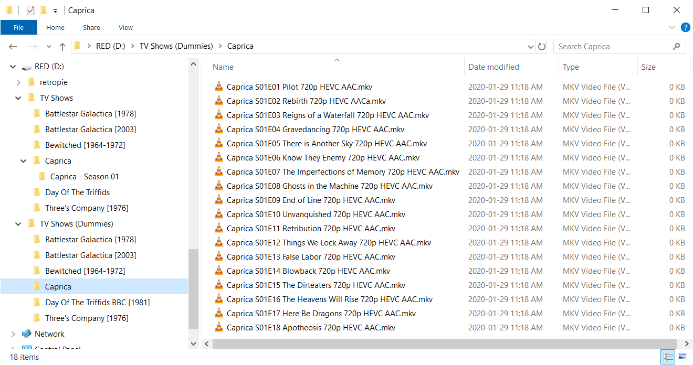

After:
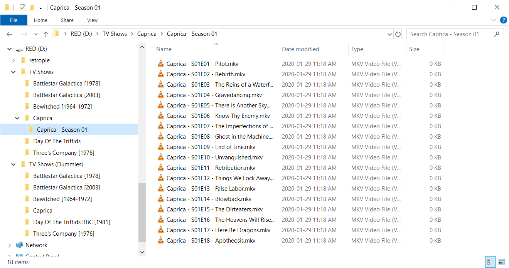

You might notice the files in the pic are 0Kb as they are all dummy files. The program does not care about what files it sees. Only their extensions. 

It can handle moving files into sub directories allowing seasons to be moved into their own folders. 

## General Options:
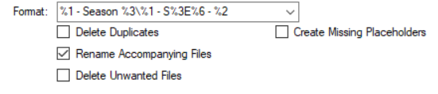

**Format**: The format to use when renaming files. Be sure to select this option before sorting out your list as the files list will refresh and any sorting you've done won't be preserved. 

**Delete Duplicates**: Any videos detected and marked as a duplicate will be deleted. (If you are unsure leave this unchecked)

**Rename Accompanying Files**: Looks for files with the same and extension and rename them to be the same as the renamed video file. 

**Delete Unwanted Files**: Any files matching an unwanted pattern in the settings will be deleted.  (If you are unsure leave this unchecked) 

**Create Missing Placeholders**: If an episode is missing from the list a ".missing" file will be created a placeholder.

## Default settings for the rename interface:
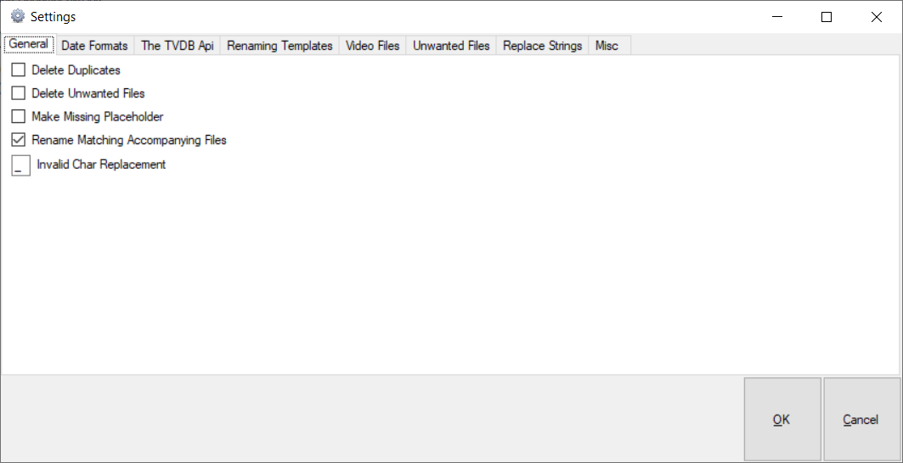

**Delete Duplicates**: Any videos detected and marked as a duplicate will be deleted. (If you are unsure leave this unchecked)

**Delete Unwanted Files**: Any files matching an unwanted pattern in the settings will be deleted.  (If you are unsure leave this unchecked) 

**Make Missing Placeholder**: If an episode is missing from the list a ".missing" file will be created a placeholder.

**Rename Matching Accompanying Files**: Looks for files with the same and extension and rename them to be the same as the renamed video file.

**Invalid Char Replacement**: If the episode contains a character not supported by the file system this is the character that will be substituted.

## Date Formats:
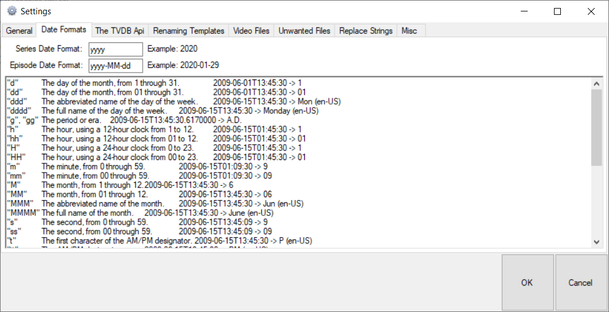

**Series Date Format**: The date format used by *%seriesyear%*

**Episode Date Format**: The date format used by *%episodeAired%*

```
"d"	The day of the month, from 1 through 31.	2009-06-01T13:45:30 -> 1
"dd"	The day of the month, from 01 through 31.	2009-06-01T13:45:30 -> 01
"ddd"	The abbreviated name of the day of the week.	2009-06-15T13:45:30 -> Mon (en-US)
"dddd"	The full name of the day of the week.	2009-06-15T13:45:30 -> Monday (en-US)
"g", "gg"	The period or era. 	2009-06-15T13:45:30.6170000 -> A.D.
"h"	The hour, using a 12-hour clock from 1 to 12.  	2009-06-15T01:45:30 -> 1
"hh"	The hour, using a 12-hour clock from 01 to 12.	2009-06-15T01:45:30 -> 01
"H"	The hour, using a 24-hour clock from 0 to 23.  	2009-06-15T01:45:30 -> 1
"HH"	The hour, using a 24-hour clock from 00 to 23.	2009-06-15T01:45:30 -> 01
"m"	The minute, from 0 through 59.	2009-06-15T01:09:30 -> 9
"mm"	The minute, from 00 through 59.	2009-06-15T01:09:30 -> 09
"M"	The month, from 1 through 12.	2009-06-15T13:45:30 -> 6
"MM"	The month, from 01 through 12.	2009-06-15T13:45:30 -> 06
"MMM"	The abbreviated name of the month.	2009-06-15T13:45:30 -> Jun (en-US)
"MMMM"	The full name of the month.	2009-06-15T13:45:30 -> June (en-US)
"s"	The second, from 0 through 59.	2009-06-15T13:45:09 -> 9
"ss"	The second, from 00 through 59.	2009-06-15T13:45:09 -> 09
"t"	The first character of the AM/PM designator. 2009-06-15T13:45:30 -> P (en-US)
"tt"	The AM/PM designator.	2009-06-15T13:45:30 -> PM (en-US)
"y"	The year, from 0 to 99.	0001-01-01T00:00:00 -> 1
"yy"	The year, from 00 to 99.	0001-01-01T00:00:00 -> 01
"yyy"	The year, with a minimum of three digits.	0001-01-01T00:00:00 -> 001
"yyyy"	The year as a four-digit number.	0001-01-01T00:00:00 -> 0001
"yyyyy"	The year as a five-digit number.	0001-01-01T00:00:00 -> 00001
"z"	Hours offset from UTC, with no leading zeros.	2009-06-15T13:45:30-07:00 -> -7
"zz"	Hours offset from UTC, with a leading zero for a single-digit value.	2009-06-15T13:45:30-07:00 -> -07
"zzz"	Hours and minutes offset from UTC.	2009-06-15T13:45:30-07:00 -> -07:00
":"	The time separator.	2009-06-15T13:45:30 -> : (en-US) 
Please note that ":" is an invalid filename char and will be replaced by the default character.
"string" Literal string delimiter.	2009-06-15T13:45:30 ("arr:" h:m t) -> arr: 1:45 P
%	Defines the following character as a custom format specifier.	2009-06-15T13:45:30 (%h) -> 1
\	The escape character.	2009-06-15T13:45:30 (h \h) -> 1 h	
```
Any other character	the character is copied to the result string unchanged.

For more technical information see: https://docs.microsoft.com/en-us/dotnet/standard/base-types/custom-date-and-time-format-strings

## TV DB API Key:
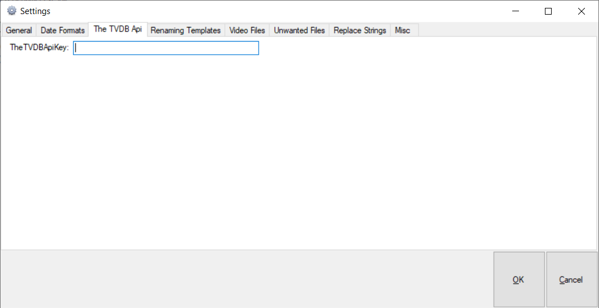

**TheTVDBApiKey**: The all-important API Key! [TVDB API Key](https://thetvdb.com/api-information)

## Renaming Templates:
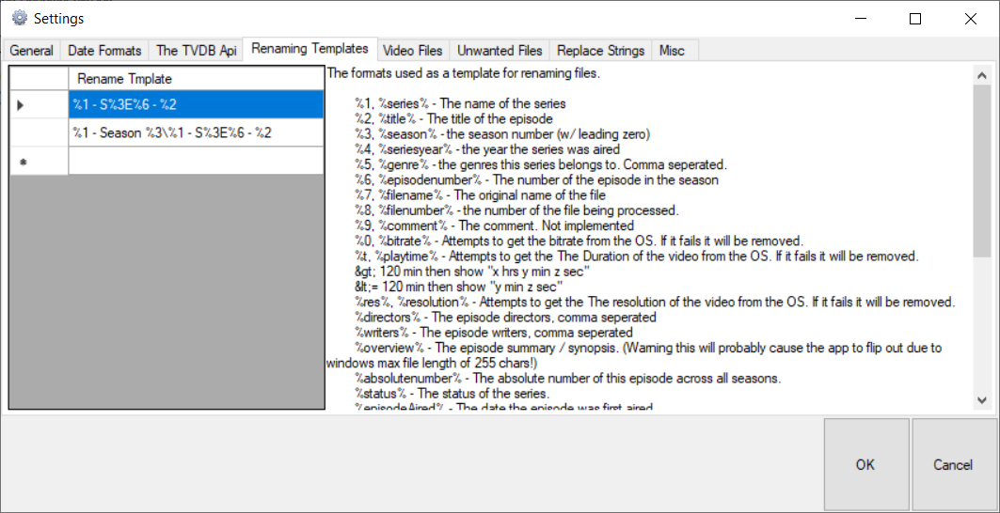

A list of templates to show in the Format dropdown list in the rename window:

The formats used as a template for renaming files. 

```
        %1 or %series% - The name of the series
        %2 or %title% - The title of the episode
        %3 or %season% - the season number (w/ leading zero)
        %4 or %seriesyear% - the year the series was aired
        %5 or %genre% - the genres this series belongs to. Comma separated.
        %6 or %episodenumber% - The number of the episode in the season
        %7 or %filename% - The original name of the file
        %8 or %filenumber% - the number of the file being processed.
        %9 or %comment% - The comment. Not implemented
        %0 or %bitrate% - Attempts to get the bitrate from the OS. If it fails it will be removed.
        %t or %playtime% - Attempts to get the duration of the video from the OS. If it fails it will be removed.
        &gt; 120 min then show "x hrs y min z sec"
        &lt;= 120 min then show "y min z sec"
        %res%, %resolution% - Attempts to get the resolution of the video from the OS. If it fails it will be removed.
        %directors% - The episode directors, comma separated
        %writers% - The episode writers, comma separated
        %overview% - The episode summary / synopsis. (Warning this will probably cause the app to flip out due to windows max file length of 255 chars!)
        %absolutenumber% - The absolute number of this episode across all seasons.
        %status% - The status of the series. 
        %episodeAired% - The date the episode was first aired. 
        %netowrk% - The network the episode was first aired on.
        %seriesoverview% - The series summary / synopsis. (Warning this will probably cause the app to flip out due to windows max file length of 255 chars!)
        %airsdayofweek% - The days of the week episodes air on, comma separated.
        %airstime% - the time of day the episodes starts, comma separated
        %rating% - The TVDB rating for this episode.
        
        Other characters will be treated at literal values. For instance:
        "%1 - S%3E%6 - %2" will result in an output file like this: "My TV Show - S01E02 - The Second episode" Notice the "E" in the template.
```

	A / or \ character will be treated as a directory separator. So, in templates with a directory separator character will create sub directories under the root directory selected (The folder selected on the left-hand side in the main window)

	For instance:
        "%1 - Season %3\%1 - S%3E%6 - %2" will result in an output file like this: "My TV Show - Season 01\My TV Show - S01E02 - The Second episode"
        
## Video Files:
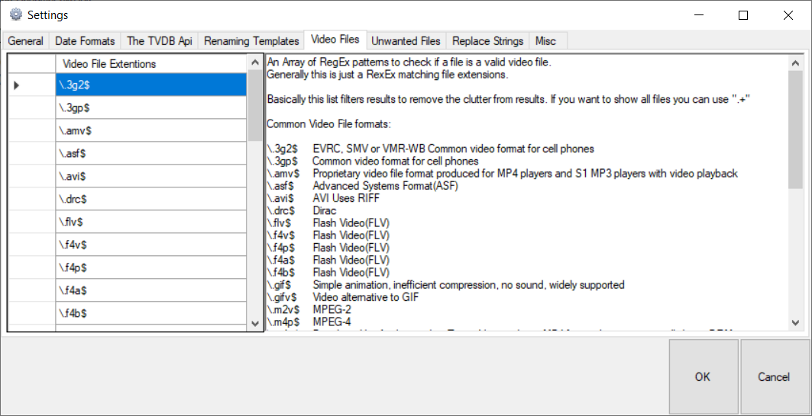

A list of file extensions to be recognized as videos.

An Array of RegEx patterns to check if a file is a valid video file. 
Generally, this is just a RegEx matching file extensions.

Basically, this list filters results to remove the clutter from results. If you want to show all files you can use ".+"

Common Video File formats:
```
\.3g2$	EVRC, SMV or VMR-WB Common video format for cell phones
\.3gp$	Common video format for cell phones
\.amv$	Proprietary video file format produced for MP4 players and S1 MP3 players with video playback
\.asf$	Advanced Systems Format (ASF)
\.avi$	AVI Uses RIFF
\.drc$	Dirac
\.flv$	Flash Video (FLV)
\.f4v$	Flash Video (FLV)
\.f4p$	Flash Video (FLV)
\.f4a$	Flash Video (FLV)
\.f4b$	Flash Video (FLV)
\.gif$	Simple animation, inefficient compression, no sound, widely supported
\.gifv$	Video alternative to GIF
\.m2v$	MPEG-2
\.m4p$	MPEG-4
\.m4v$	Developed by Apple, used in iTunes. Very similar to MP4 format, but may optionally have DRM.
\.mkv$	Matroska
\.mng$	Multiple-image Network Graphics
\.mov$	QuickTime File Format
\.mp4$	MPEG-4
\.mp2$	MPEG-1
\.mpe$	MPEG-1
\.mpeg$	MPEG-1
\.mpg$	MPEG-1
\.mpv$	MPEG-1
\.mxf$	Material Exchange Format (MXF)
\.nsv$	Nullsoft Streaming Video (NSV) 
\.ogv$	Ogg Theora, Dirac Vorbis, FLAC
\.ogg$	Ogg Video
\.qt$	QuickTime File Format
\.rm$	RealMedia (RM) (Really who uses this format after the s/w fiasco?!?!?)
\.rmvb$	RealMedia Variable Bitrate (RMVB) (Really who uses this format after the s/w fiasco?!?!?)
\.roq$	used by Quake 3
\.svi$	Samsung video format for portable players
\.vob$	Files in VOB format have .vob filename extension and are typically stored in the VIDEO_TS folder at the root of a DVD. The VOB format is based on the MPEG program stream format.
\.webm$	Royalty-free format created for HTML5 video.
\.wmv$	Windows Media Video
\.yuv$	Raw video format
```

## Unwanted Files:
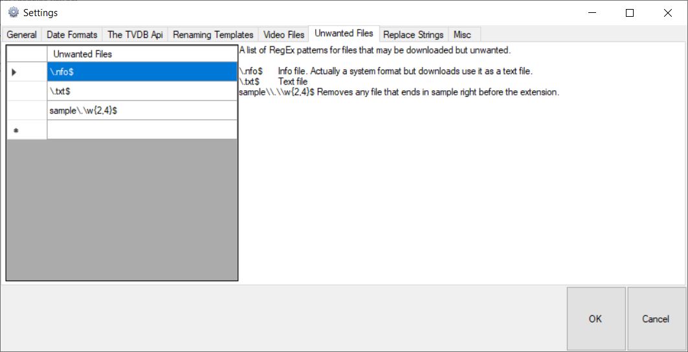

A list of RegEx patterns for files that may be downloaded but unwanted. When "Delete Unwanted Files" is checked then any files matching this pattern will also be deleted. Any other files that aren't on this list and not video or accompanying files will be ignored.

```
\.nfo$	Info file. Actually, a system format but downloads use it as a text file.
\.txt$	Text file
sample\\.\\w{2,4}$	Removes any file that ends in sample right before the extension.
```

## Replace Strings:
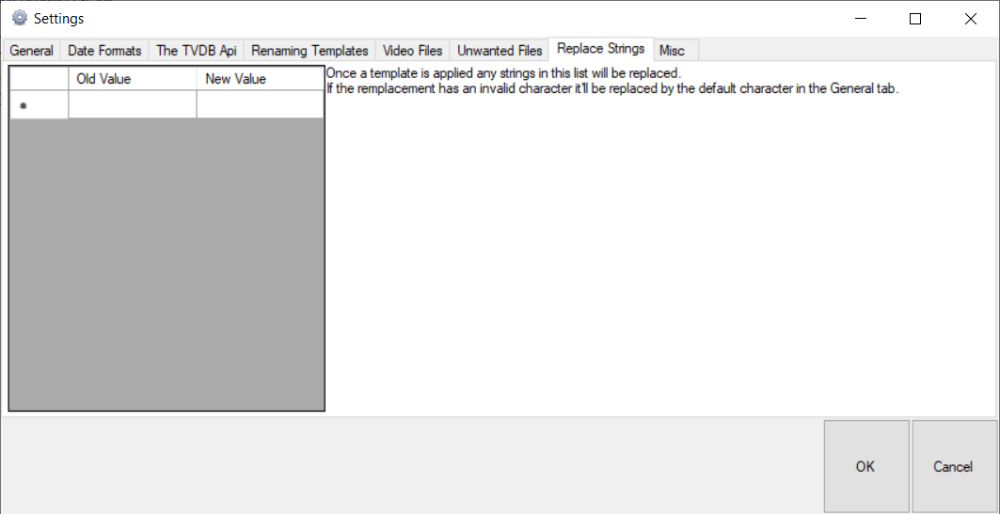

Once a template is applied any strings in this list will be replaced. 
If the replacement has an invalid character it'll be replaced by the default character in the General tab.

So, using the above example, if there is a pair of strings: "Second" -> "2nd"
"My TV Show - S01E02 - The Second episode" will become: "My TV Show - S01E02 - The 2nd episode"


If you want to use the TVDB Api in C# this solution has the API in a separate library allowing for easy implementation into other projects. 

## In Action:

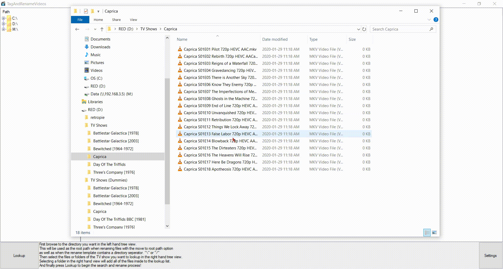

Typical Disclaimer: 

All information posted here is merely for educational and informational purposes. Should you decide to act upon any information on this repository, you do so at your own risk. I am not affiliated with The TV DB in any way and this project has not been endorsed by them. And for the love of god backup *EVERYTHING*! I am not responsible for any damages or loss of data.
